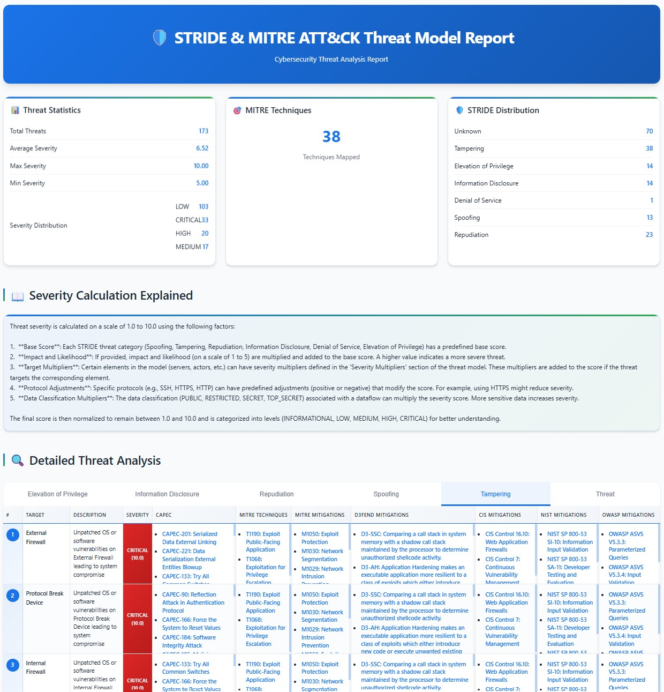
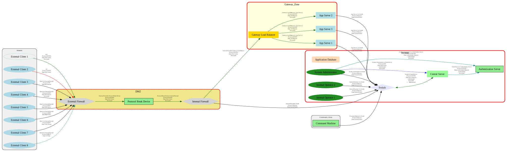

# STRIDE Threat Analysis Framework with MITRE ATT&CK Integration

## Overview

This project is a Python-based, end-to-end STRIDE threat modeling and analysis framework with MITRE ATT&CK mapping. It enables you to:

- **Model your system architecture** in Markdown (`threat_model.md`), including boundaries, actors, servers, data, and dataflows.
- **Automatically identify STRIDE threats** for each component and dataflow.
- **Map threats to MITRE ATT&CK techniques** for actionable, real-world context.
- **Calculate severity** using customizable base scores, target multipliers, and protocol adjustments.
- **Generate detailed reports** (HTML, JSON) and **visual diagrams** (DOT, SVG, HTML) with threat highlights.
- **Extend and customize** all mappings, calculations, and reporting logic.

> **Based on [PyTM](https://github.com/OWASP/pytm):** This framework leverages PyTM's modeling primitives and extends them with advanced reporting, MITRE mapping, and diagram generation.

---

## Features

- **Markdown-based Threat Modeling**: Use a simple DSL to describe your architecture and flows.
- **Automated STRIDE Analysis**: Detects threats for each element and flow.
- **MITRE ATT&CK Mapping**: Each threat is mapped to relevant MITRE tactics and techniques.
- **Severity Calculation**: Customizable scoring (base, target, protocol).
- **Comprehensive Reporting**:
  - HTML report with integrated threat statistics, detailed threat information, STRIDE/MITRE mapping, and D3FEND mitigations.
  - JSON export for integration or further analysis.
- **Visual Diagrams**:
  - DOT, SVG, and HTML diagrams with threat highlights.
- **Extensible**: All mappings and calculations are modular and easy to override.
- **PyTM Compatibility**: Supports PyTM's model structure and can be extended with PyTM's features.

---

## Example Output

After running the analysis, you will find a timestamped folder in `output/` (e.g., `output/example`) containing:

- `stride_mitre_report.html`:  
  
- `mitre_analysis.json`:  
  ```json
  {
    "analysis_date": "2025-06-29T15:31:56.517773",
    "threats_detected": 183,
    "threat_types": [
      "Threat",
      "Tampering",
      "Information Disclosure",
      "Elevation of Privilege",
      "Spoofing",
      "Denial of Service",
      "Repudiation"
    ],
    "mitre_mapping": {
      "Spoofing": {
        "tactics": [
          "Initial Access",
          "Defense Evasion",
          "Credential Access"
        ],
        "techniques": [
          {
            "id": "T1566",
            "name": "Phishing",
            "description": "Identity spoofing via phishing"
          }
        ]
      },
      "Tampering": {
        "tactics": [
          "Defense Evasion",
          "Impact",
          "Initial Access",
          "Execution"
        ],
        "techniques": [
          {
            "id": "T1565",
            "name": "Data Manipulation",
            "description": "Unauthorized data modification"
          }
        ]
      }
    },
    "detailed_threats": [
      {
        "type": "Threat",
        "description": "Vulnerability in the management interface of External Firewall",
        "target": "External Firewall",
        "severity": {"score": 8.5, "level": "HIGH"},
        "mitre_techniques": [{"id": "T1068", "name": "Exploitation for Privilege Escalation"}],
        "stride_category": "Elevation of Privilege"
      },
      {
        "type": "Threat",
        "description": "Lateral movement from Central Server to other systems in the network",
        "target": "Central Server",
        "severity": {"score": 8.5, "level": "HIGH"},
        "mitre_techniques": [{"id": "T1021", "name": "Remote Services"}],
        "stride_category": "Elevation of Privilege"
      },
      {
        "type": "Threat",
        "description": "Insecure security configuration or hardening on App Server 1",
        "target": "App Server 1",
        "severity": {"score": 6.0, "level": "MEDIUM"},
        "mitre_techniques": [{"id": "T1562", "name": "Impair Defenses"}],
        "stride_category": "Information Disclosure"
      },
      {
        "type": "Threat",
        "description": "Data exfiltration or leakage from Application Database",
        "target": "Application Database",
        "severity": {"score": 8.5, "level": "HIGH"},
        "mitre_techniques": [{"id": "T1041", "name": "Exfiltration Over C2 Channel"}],
        "stride_category": "Information Disclosure"
      }
    ]
  }
  ```
- `tm_diagram__example.dot`:  
  (Graphviz DOT format for architecture)
- `tm_diagram__example.svg`:  
  

> **Note:** All screenshots and example files are located in the `output/example/` directory for easy preview and documentation.

---


## Example Threat Model (`threat_model.md`)

```markdown
# Threat Model: Advanced DMZ Architecture

## Description
A network with a DMZ, external/internal firewalls, and a command zone. The goal is to identify STRIDE threats and map them to MITRE ATT&CK.

## Boundaries
- **Internet**: color=lightcoral
- **DMZ**: color=khaki
- **Intranet**: color=lightgreen
- **Command Zone**: color=lightsteelblue

## Actors
- **External Client 1**: boundary=Internet
- **Operator**: boundary=Command Zone

## Servers
- **External Firewall**: boundary=DMZ
- **Internal Firewall**: boundary=Intranet
- **Central Server**: boundary=Intranet

## Data
- **Web Traffic**: classification=public, lifetime=transient

## Dataflows
- **External Client to External Firewall**: from="External Client 1", to="External Firewall", protocol="HTTPS", data="Web Traffic", is_encrypted=True

## Severity Multipliers
- **Central Server**: 1.5
- **External Firewall**: 2.0

## Custom Mitre Mapping
- **Protocol Tampering**: tactics=["Impact", "Defense Evasion"], techniques=[{"id": "T1565", "name": "Data Manipulation"}]
```

## Bidirectional Dataflow Visualization

This makes bidirectional communications visually clear and reduces clutter in your architecture diagrams.

**Example:**

If your model contains:
```markdown
## Dataflows
- A to B: from="A", to="B", protocol="HTTPS"
- B to A: from="B", to="A", protocol="HTTPS"
```

The diagram will show:
```
A <--> B
```
(with a single arrow using `dir="both"` in DOT/Graphviz)

This feature is enabled by default and works for all protocols.

---

## Threat Model as Code

This framework is designed to be used in a "Threat Model as Code" workflow. This means that the threat model is defined in a simple, version-controllable format (Markdown), and the analysis is performed by running a script. This approach has several advantages:

- **Version Control**: Threat models can be stored in a Git repository, allowing you to track changes over time.
- **Automation**: The threat modeling process can be integrated into your CI/CD pipeline, allowing you to automatically update your threat model whenever your architecture changes.
- **Collaboration**: Developers can collaborate on the threat model using the same tools they use for code.

### How to Perform a Threat Model as Code

1. **Define your architecture**: Edit the `threat_model.md` file to describe your system's architecture. You can define boundaries, actors, servers, data, and dataflows.
2. **Run the analysis**: Run the `main_analysis.py` script to perform the threat analysis. This will generate a set of reports and diagrams in the `output/` directory.
3. **Review the results**: Review the generated reports and diagrams to identify and prioritize threats.
4. **Iterate**: As your architecture changes, update the `threat_model.md` file and re-run the analysis to keep your threat model up-to-date.

---

---

## Web-Based Threat Model Editor (Optional)

This project includes an optional, lightweight web server that provides a graphical interface for editing your threat model in real-time.

**Features:**
- **Live Preview**: See your threat model diagram update instantly as you type.
- **Markdown Editor**: A simple, clean interface for writing your threat model.
- **Export Functionality**:
  - Save the Markdown model (`.md`).
  - Export the diagram as an SVG file.
  - Export the diagram as a self-contained HTML file (with legend).
  - Export the full HTML analysis report.

### How to Use the Web Editor

1.  **Install Flask (if you haven't already):**
    ```bash
    pip install Flask
    ```

2.  **Run the server:**
    ```bash
    python threat_analysis/server/server.py
    ```

3.  **Open your browser** and navigate to `http://127.0.0.1:5001`.

> **Note:** The web server is an optional feature. All core functionalities of the framework remain accessible via the command line without needing to install Flask or run the server.

---

## Installation

1. **Clone the repository:**
    ```bash
    git clone <repository_url>
    cd <repository_name>
    ```

2. **Install Python dependencies:**
    ```bash
    pip install pytm
    ```

3. **Install Graphviz (for diagram generation):**
    - Windows: [https://graphviz.org/download/](https://graphviz.org/download/)
    - macOS: `brew install graphviz`
    - Linux: `sudo apt-get install graphviz`

After installation, restart your terminal or IDE.

---

## Usage

This framework supports two modes of operation: Command Line Interface (CLI) for automated analysis and a Web-based Graphical User Interface (GUI) for interactive editing and visualization.

### 1. Command Line Interface (CLI) Mode

Use the CLI mode for automated threat analysis, report generation, and diagram creation. This is ideal for integration into CI/CD pipelines or batch processing.

1.  **Edit `threat_model.md`** to describe your architecture.
2.  **Run the analysis:**
    ```bash
    python main_analysis.py --model-file threat_model.md
    ```
    (You can omit `--model-file threat_model.md` if your model file is named `threat_model.md` and is in the root directory.)
3.  **View the results** in the generated `output/` folder:
    - HTML report
    - JSON export
    - DOT/SVG/HTML diagrams

### 2. Web-based Graphical User Interface (GUI) Mode

Launch the interactive web editor to visualize your threat model in real-time, edit Markdown content, and export various formats directly from your browser.

1.  **Install Flask (if you haven't already):**
    ```bash
    pip install Flask
    ```

2.  **Launch the GUI:**
    ```bash
    python main_analysis.py --gui
    ```
    The console will display the address (e.g., `http://127.0.0.1:5001`) where you can access the GUI in your web browser.

> **Note:** When using `--gui`, the `--model-file` option can be used to load an initial threat model as a template into the editor. If not provided, the GUI will start with an empty editor. The GUI mode requires Flask. If Flask is not installed, the `--gui` option will inform you how to install it. The CLI mode does not require Flask.

---

## Model Capabilities

- **STRIDE Threat Detection**: Spoofing, Tampering, Repudiation, Information Disclosure, Denial of Service, Elevation of Privilege.
- **MITRE ATT&CK Mapping**: Each STRIDE threat is mapped to one or more MITRE ATT&CK techniques and tactics.
- **Severity Calculation**: 
  - Base scores per STRIDE category.
  - Target multipliers (e.g., critical servers).
  - Protocol-based adjustments (e.g., HTTP vs HTTPS).
- **Diagram Generation**:
  - DOT, SVG, and HTML diagrams with threat highlights and legends.
- **Report Generation**:
  - HTML report with summary, statistics, threat details, and recommendations.
  - JSON export for integration or further analysis.
- **Extensibility**:
  - Add new STRIDE categories or custom threat patterns.
  - Extend MITRE mappings.
  - Customize severity logic.
  - Integrate with PyTM models and features.

---

## PyTM-Based Extensions & Evolutions

You can leverage and extend all PyTM features, including:

- **Custom Threat Patterns**: Define new threat types and detection logic.
- **Advanced Dataflow Modeling**: Use PyTM's dataflow and element types.
- **Integration with PyTM Plugins**: Use or develop plugins for reporting, risk scoring, or compliance.
- **Automated Testing**: Integrate with PyTM's test harness for CI/CD.
- **Custom Reports**: Extend the reporting module to output in any format (PDF, Excel, etc.).
- **Visualization**: Use PyTM's or your own visualization tools for advanced diagrams.

---

## Limitations

- **Severity Multipliers** and **Custom MITRE Mapping** defined in `threat_model.md` are not yet parsed automatically (see logs for "ignored" messages). Programmatic customization is supported.
- The default architecture is DMZ-oriented; adapt the model for your environment as needed.

---

## TODO

- Add more realistic threats to the `custom_threats.py` module.
- Improve threat generation to specifically account for special boundaries like DMZ and Gateway, and the components within them.
- Enhance MITRE ATT&CK mapping in `mitre_mapping_module.py` to include more techniques per threat where applicable.
- **Automated and Enriched Mitigation Suggestions**: Propose mitigations based on recognized frameworks (OWASP ASVS, NIST, CIS Controls) for each identified MITRE ATT&CK technique.
    - **Step 1: Research and Data Acquisition**: Identify relevant mitigation frameworks (OWASP ASVS, NIST SP 800-53, CIS Controls). Research existing mappings to MITRE ATT&CK or define a strategy to create them. Acquire mitigation data (ID, name, description, official links).
    - **Step 2: Data Integration**: Create new data structures (e.g., in `mitre_mapping_module.py` or a new module) to store enriched mitigations. Modify initialization functions to load this data.
    - **Step 3: Mapping Logic Update**: Extend `map_threat_to_mitre` logic to associate identified MITRE ATT&CK techniques with relevant enriched mitigations.
    - **Step 4: Report Display**: Modify `report_generator.py` to include a new section or column in the HTML report to display these enriched mitigations with proper links.
- **Interactive Web User Interface (GUI)**: Develop a lightweight web interface to visualize and interact with the threat model.
    - **Step 1: Web Framework Selection**: Choose a Python web framework (e.g., Flask, FastAPI) for the backend and a frontend approach (e.g., Jinja2, Vue.js/React).
    - **Step 2: Backend API Development**: Create API endpoints for loading/saving `threat_model.md`, triggering analysis, and retrieving results.
    - **Step 3: Frontend (Model Editor)**: Build a web interface for editing `threat_model.md` with syntax highlighting and a button to run analysis.
    - **Step 4: Frontend (Results Visualization)**: Create views to display the generated HTML report, interactive SVG diagrams (clickable components), and sortable/filterable threat tables.
    - **Step 5: Containerization (Optional)**: Use Docker for easy deployment and execution.
- **Advanced Threat Model Validation**: Implement stricter checks for `threat_model.md` (syntax, consistency, undefined elements) with clear error messages.
    - **Step 1: Define Validation Rules**: List comprehensive validation rules for `threat_model.md` (e.g., valid element references, unique names, required attributes).
    - **Step 2: Implement Validation Module**: Create a new module (e.g., `threat_analysis/model_validator.py`) with validation functions.
    - **Step 3: Integrate into Analysis Flow**: Call validation functions at the beginning of `ThreatModel.process_threats`. Stop analysis and return detailed errors if validation fails.
    - **Step 4: Clear Error Reporting**: Ensure error messages are explicit, indicating file, line (if possible), and nature of the problem.
- **Integration with Vulnerability Databases (CVE)**: Link identified MITRE ATT&CK techniques to known CVEs or common vulnerabilities (e.g., OWASP Top 10).
    - **Step 1: Research CVE Data Sources**: Identify reliable CVE sources (e.g., NVD API) and understand their data formats.
    - **Step 2: MITRE ATT&CK to CVE Mapping**: Research existing mappings or develop logic to infer potential CVEs from threat descriptions/MITRE techniques.
    - **Step 3: CVE Data Retrieval and Processing**: Implement functions to query CVE databases using identified MITRE techniques. Store relevant CVE info (ID, description, CVSS score, links).
    - **Step 4: Report Display**: Modify `report_generator.py` to include associated CVEs in HTML and JSON reports. Use CVSS scores to enhance severity prioritization.
- **Pre-defined Architecture Templates**: Offer a library of pre-built threat models for common architectures (web applications, microservices, IoT, etc.).
    - **Step 1: Define Template Structure**: Create a dedicated directory (e.g., `templates/`) for `threat_model.md` files and optional custom Python files.
    - **Step 2: Create Initial Templates**: Develop basic templates for common architectures (e.g., "3-tier Web Application", "Simple IoT System").
    - **Step 3: Implement Loading Mechanism**: Add a function in `ThreatModel` or a new utility module to list and load selected templates.
    - **Step 4: CLI/GUI Integration**: Add a CLI option (e.g., `--template "web_app"`) or GUI elements (dropdowns, buttons) to select and load templates.

## Technical Debt / Refactoring Opportunities


---

## License

Apache License 2.0. See [LICENSE](LICENSE).

---

## Author

ellipse2v