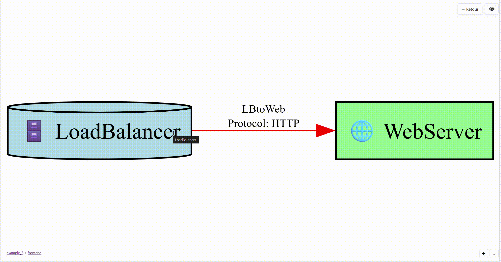
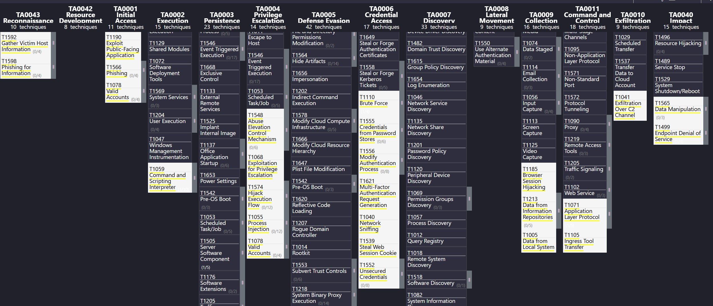

# Home: Elevating Cyber Resilience with Automated Threat Modeling

Welcome to the official GitHub Wiki for the **Automated Threat Modeling Framework with STRIDE, MITRE ATT&CK, and IaC Integration**.

In an era of escalating cyber threats and rapid development cycles, traditional security practices often fall short. This framework is engineered to bridge that gap, transforming reactive security into proactive cyber resilience. It's more than a tool; it's a paradigm shift towards **Threat Modeling as Code (TMasC)**, empowering development, security, and operations teams to embed security from inception.

## Documentation Sections

- [Roadmap](Roadmap) - Project roadmap and future plans
- [Technical Documentation](technical_documentation) - Technical details and specifications


## Table of Contents

1.  [The Cyber Imperative: Why Automated Threat Modeling?](#the-cyber-imperative-why-automated-threat-modeling)
2.  [Core Capabilities: Unveiling the Power of the Framework](#core-capabilities-unveiling-the-power-of-the-framework)
3.  [Getting Started: Fortifying Your Defenses](#getting-started-fortifying-your-defenses)
4.  [Operationalizing Security: CLI, GUI, and IaC Integration](#operationalizing-security-cli-gui-and-iac-integration)
5.  [Architecting for Resilience: The Threat Model DSL](#architecting-for-resilience-the-threat-model-dsl)
6.  [Extending Your Cyber Arsenal: Customization & Evolution](#extending-your-cyber-arsenal-customization--evolution)
7.  [The Path Forward: Roadmap & Strategic Vision](#the-path-forward-roadmap--strategic-vision)
8.  [Contributing to Cyber Defense](#contributing-to-cyber-defense)
9.  [License & Attribution](#license--attribution)

---

## The Cyber Imperative: Why Automated Threat Modeling?

In today's dynamic threat landscape, security cannot be an afterthought. Manual threat modeling is often slow, inconsistent, and struggles to keep pace with agile development. This framework champions **Continuous Threat Modeling** and **Threat Modeling as Code (TMasC)**, enabling:

-   **Proactive Risk Identification**: Shift left on security by identifying design flaws and vulnerabilities early in the SDLC.
-   **Scalable Security**: Automate threat analysis across complex, distributed systems and microservices.
-   **Actionable Intelligence**: Translate abstract threats into concrete, MITRE ATT&CK-mapped techniques for targeted defense.
-   **DevSecOps Enablement**: Foster seamless collaboration between development, security, and operations teams through version-controlled, machine-readable threat models.
-   **Continuous Assurance**: Integrate threat analysis into CI/CD pipelines for ongoing security validation.

## Core Capabilities: Unveiling the Power of the Framework

This framework is built upon robust security principles and industry-leading intelligence:

-   **STRIDE-based Threat Identification**: Automatically uncovers threats across Spoofing, Tampering, Repudiation, Information Disclosure, Denial of Service, and Elevation of Privilege categories for every component and dataflow.
-   **Rich Threat Enrichment**: Each identified threat is meticulously mapped to relevant **MITRE ATT&CK** tactics and techniques, **CAPEC** attack patterns, and **D3FEND** countermeasures, providing real-world context and actionable defensive strategies.
-   **Context-Aware Threat Generation**: Threats are dynamically generated based on dataflow properties such as encryption (`is_encrypted`) and authentication (`is_authenticated`). For instance, unencrypted dataflows will automatically trigger "Information Disclosure" threats, with increased severity if sensitive data is involved.
-   **Hierarchical Threat Modeling**: Analyze complex systems by breaking them down into smaller, interconnected sub-models. The framework can process an entire project directory and generate navigable diagrams.
-   **Dynamic Severity Calculation**: Customizable scoring mechanisms (base scores, target multipliers, protocol adjustments) provide a precise risk posture for each threat.
-   **Comprehensive Reporting & Visualization**: Generate rich HTML reports, STIX 2.1 exports, and intuitive diagrams (SVG, PNG, interactive HTML). Crucially, export to **MITRE ATT&CK Navigator** layers for advanced visualization and analysis.
-   **Extensible Security Logic**: All threat detection rules, MITRE mappings, and severity calculations are modular, allowing for easy customization and adaptation to unique organizational contexts.

## Getting Started: Fortifying Your Defenses

Embark on your journey to enhanced cyber resilience:

1.  **Acquire the Arsenal:**
    ```bash
    git clone https://github.com/ellipse2v/threatModelBypyTm.git
    cd threatModelBypyTm
    ```

2.  **Provision Dependencies:**
    ```bash
    pip install -r requirements.txt
    ```

3.  **Integrate Visual Intelligence (Graphviz):**
    Diagram generation relies on Graphviz. Install it via your preferred method:
    *   Windows: [https://graphviz.org/download/](https://graphviz.org/download/)
    *   macOS: `brew install graphviz`
    *   Linux: `sudo apt-get install graphviz`
    (Restart your terminal/IDE after installation.)

## Operationalizing Security: CLI, GUI, and IaC Integration

This framework offers versatile operational modes to fit your security workflow.

### The TMasC Philosophy in Action

At its heart, this tool embodies Threat Modeling as Code. Your threat models are defined in human-readable, version-controllable Markdown. This enables:

-   **Version Control**: Track every evolution of your threat landscape.
-   **Automation**: Integrate security analysis directly into your CI/CD pipelines.
-   **Collaboration**: Empower cross-functional teams with a shared, transparent view of risks.

### Command Line Interface (CLI): Orchestrating Automated Analysis

For automated workflows, CI/CD integration, and batch processing:

-   **Single Model Analysis**: 
    ```bash
    python -m threat_analysis --model-file path/to/your_model.md
    ```
-   **Project-Wide Analysis**: Analyze a hierarchical project with nested models.
    ```bash
    python -m threat_analysis --project path/to/your_project/
    ```
-   **Generate ATT&CK Navigator Layer**: Add the `--navigator` flag to any analysis command to generate a `json` layer file.
    ```bash
    python -m threat_analysis --project path/to/your_project/ --navigator
    ```

### Infrastructure as Code (IaC) Integration: Bridging Dev & SecOps

Generate a complete threat model directly from your Ansible configurations.

-   **Generate & Analyze from Ansible**:
    ```bash
    python -m threat_analysis --ansible-path path/to/your/playbook.yml
    ```
-   **The `threat_model_metadata` Variable**: To create a rich and accurate model, the Ansible plugin looks for a special `threat_model_metadata` variable inside your playbook's `vars`. This is where you define the security architecture (zones, actors, dataflows, etc.). This approach keeps the threat model definition directly alongside the infrastructure it describes. The file `threat_analysis/iac_plugins/ansible_threat_model_config.yml` serves as a template for this structure.

### Web-based Graphical User Interface (GUI): Visualizing the Attack Surface

For interactive exploration, real-time editing, and immediate feedback:

1.  **Launch the Cyber Cockpit:**
    ```bash
    python -m threat_analysis --gui
    ```
2.  **Load a Model (Optional)**: To start with an existing model, use the `--model-file` argument.
    ```bash
    python -m threat_analysis --gui --model-file path/to/your_model.md
    ```

## Architecting for Resilience: The Threat Model DSL

The framework leverages a intuitive Markdown-based DSL to define your system's architecture. This human-readable format facilitates collaboration and version control. Explore example models in the `threatModel_Template/` directory.

**Key DSL Elements:**

-   **Boundaries**: Define trust zones and network segmentation.
-   **Actors**: Represent users, systems, and external entities interacting with your system.
-   **Servers**: Model applications, databases, firewalls, and other infrastructure components.
-   **Data**: Classify data based on sensitivity and lifecycle.
-   **Dataflows**: Map communication paths between elements, including protocols and encryption.
-   **Protocol Styles**: Customize visualization of dataflows for clarity.
-   **Severity Multipliers**: Fine-tune risk scoring for critical assets.
-   **Custom MITRE Mapping**: Extend and tailor MITRE ATT&CK mappings to your specific threat intelligence.

## Extending Your Cyber Arsenal: Customization & Evolution

This framework is designed for adaptability, allowing you to tailor its capabilities to your unique security requirements:

-   **Modular Threat Detection**: Define new STRIDE categories or custom threat patterns in `threat_rules.py`.
-   **Flexible MITRE Mappings**: Extend and override existing MITRE ATT&CK mappings.
-   **Customizable Severity Logic**: Adjust risk scoring algorithms to align with your organizational risk appetite.

## The Path Forward: Roadmap & Strategic Vision

Our commitment to continuous improvement drives the evolution of this framework. See the [Roadmap](Roadmap) for a detailed list of planned features.

## Contributing to Cyber Defense

We welcome contributions from the cybersecurity and development communities. Your insights and expertise are invaluable in strengthening this framework.

## Showcase

### GUI


### Project Structure



### MITRE ATT&CK Navigator Integration



## License & Attribution

This project is licensed under the Apache License 2.0. See the [LICENSE](LICENSE) file for details.

---

**Author:** ellipse2v
