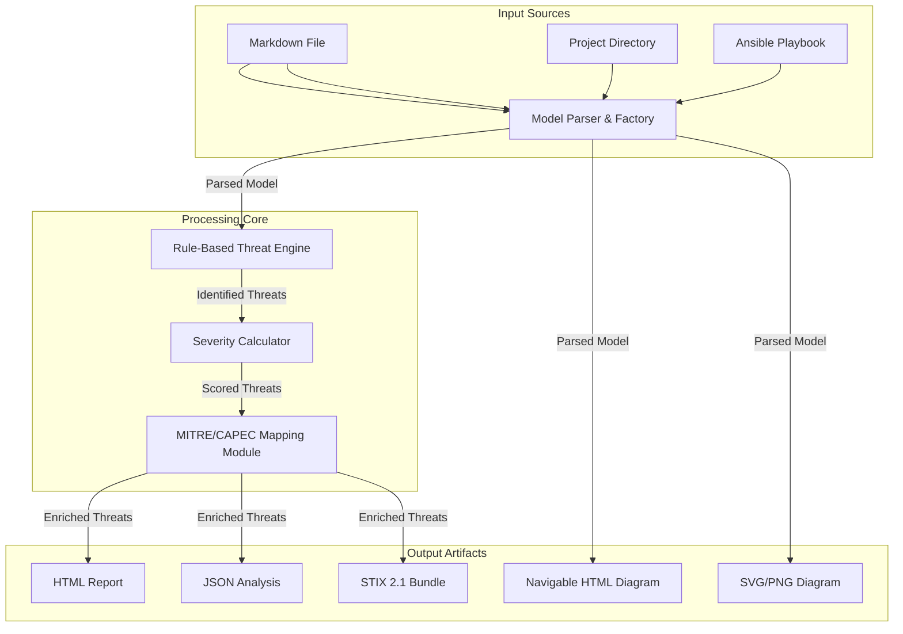
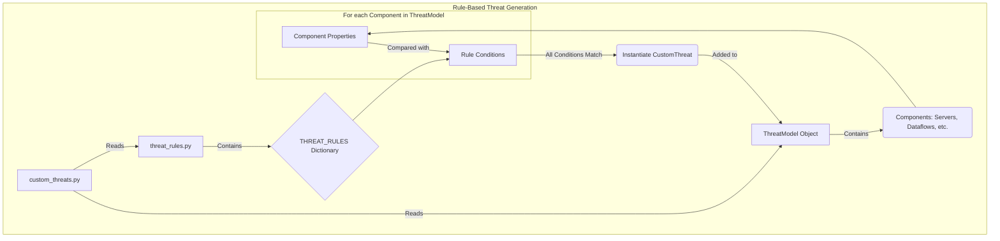
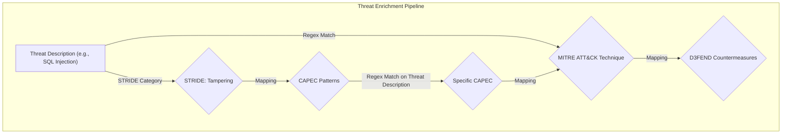
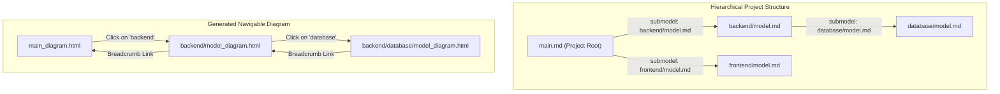

# ThreatModelByPyTM: A Technical Deep Dive

## 1. Introduction

### 1.1. The Challenge: From Manual Diagrams to Automated Analysis

As software systems grow in complexity, proactively identifying security vulnerabilities during the design phase is significantly more effective than reacting to them post-deployment. Threat modeling provides a structured process for this, but traditional approaches often rely on manual diagramming and static documents that are difficult to maintain and impossible to integrate into automated development pipelines.

This document provides a detailed technical overview of the **ThreatModelByPyTM** framework, a tool designed to address these challenges by treating the threat model as a living artifact that evolves with the system itself.

### 1.2. Core Philosophy: System-Level Threat Model as Code

The guiding philosophy of this framework is **Threat Model as Code (TMaC)**, applied at the **system level**. Instead of focusing on abstract application components, our approach defines the entire system architecture—including infrastructure, network boundaries, and data flows—in a simple, version-controllable format.

This is particularly powerful when generating models directly from **Infrastructure as Code (IaC)** sources like Ansible playbooks. By parsing the same files that define the deployed environment, the framework creates a threat model that is a true representation of the running system. This enables a seamless, automated workflow where changes in infrastructure are immediately reflected in the threat analysis.

By defining the system in a Markdown DSL, the threat model becomes:
-   **Versioned**: Stored in Git to track its evolution alongside the source code and infrastructure code.
-   **Automated**: Integrated directly into CI/CD pipelines to run analysis on every change.
-   **Collaborative**: Developers and operations engineers can contribute using the same tools and workflows they use for code.

## 2. Comparison with Other Threat Modeling Tools

To understand the unique value of ThreatModelByPyTM, it's useful to compare it to other popular tools, focusing on the key differentiator: **automation**.

| Feature | Microsoft TMT | OWASP Threat Dragon | ThreatModelByPyTM (This Tool) |
| :--- | :--- | :--- | :--- |
| **Primary Paradigm** | GUI-based Diagramming | Web-based Diagramming | **Threat Model as Code (TMaC)** |
| **Input Format** | Proprietary `.tm7` format | JSON, with a web UI | **Markdown (DSL) / IaC Playbooks** |
| **Automation & CI/CD** | None. Fully manual process. | Limited. Has an API but is not designed for pipeline integration. | **Core Feature**. Designed to be run from the CLI in a pipeline. |
| **IaC Integration** | None. | None. | **Yes (Ansible)**. Can generate a model directly from infrastructure definitions. |
| **Version Control** | Possible by archiving the `.tm7` model file. However, the format is complex (XML-based) and not well-suited for line-by-line diffing or merging. | Feasible (JSON), but the diagram is the primary source of truth, not the code. | **Seamless**. Markdown is text-based and ideal for Git. |
| **Extensibility** | Limited to templates. | Good. Open-source and extensible. | **High**. Mappings and logic are in simple Python dictionaries and modules. |
| **Visualization & Reporting** | Basic reports. | Printable report, basic threat view. | Rich HTML reports, STIX 2.1 export, **MITRE ATT&CK Navigator layers**. |

## 3. High-Level Architecture

The framework is a Python-based application that can be run as a command-line tool (for automation) or a web server (for interactive editing). It ingests a threat model source and produces a suite of artifacts.



## 4. Technical Deep Dive: Module by Module

This section provides a comprehensive breakdown of each component of the ThreatModelByPyTM framework.

### 4.1. Entrypoint and Orchestration (`threat_analysis/__main__.py`)

The execution of the framework begins in `__main__.py`. This script is responsible for:
-   **Argument Parsing**: It uses a `CustomArgumentParser` to handle command-line arguments. This includes standard arguments like `--model-file`, `--gui`, `--project`, and `--navigator`, but it also dynamically loads IaC plugins from the `iac_plugins` directory and adds corresponding arguments for them (e.g., `--ansible-path`).
-   **Mode Selection**: It determines the execution mode based on the arguments:
    -   `--gui`: Launches the Flask web server via `server.run_gui()`.
    -   `--project`: Initiates a hierarchical project analysis via `report_generator.generate_project_reports()`.
    -   `--<iac-plugin>-path`: Triggers the IaC import workflow.
    -   Default: Proceeds with a standard single-file analysis.
-   **Framework Orchestration**: For standard and IaC-based runs, it instantiates the `ThreatAnalysisFramework` class, which coordinates the entire analysis pipeline from model loading to report generation. If the `--navigator` flag is present, it also triggers the generation of the ATT&CK Navigator layer. For project-based runs, it calls `report_generator.generate_project_reports()` and then, if the `--navigator` flag is present, generates a consolidated ATT&CK Navigator layer for the entire project.

### 4.2. Core Model (`threat_analysis/core/models_module.py`)

The `ThreatModel` class is the heart of the framework, serving as the in-memory representation of the system under analysis. It is designed to be a rich, stateful object that not only holds the architectural components but also orchestrates the analysis process.

-   **A Wrapper Around PyTM**: At its core, the `ThreatModel` class wraps a `pytm.TM` object. This allows the framework to leverage the foundational threat generation logic of the PyTM library while extending it with custom features, more detailed component attributes, and advanced analysis capabilities.

-   **Key Data Structures**: The class maintains several dictionaries and lists to manage the components of the threat model:
    -   `boundaries`, `actors`, `servers`, `dataflows`, `data_objects`: These collections store not just the `pytm` objects themselves, but also associated metadata defined in the Markdown DSL, such as custom properties, colors for diagramming, or links to sub-models.
    -   `protocol_styles`: A dictionary to store custom styling rules for dataflow protocols (e.g., making `HTTPS` flows appear as green solid lines and `HTTP` as red dashed lines in diagrams).
    -   `severity_multipliers`: Stores multipliers for specific components, allowing for a more nuanced risk calculation.
    -   `_elements_by_name`: This dictionary is a critical optimization. It provides an O(1) lookup for any component in the model by its name, which is essential for quickly resolving relationships during parsing and analysis (e.g., finding the source and sink objects for a dataflow).

-   **Element Management**: The `add_*` methods (e.g., `add_boundary`, `add_server`, `add_dataflow`) are the primary interface for building the model. They are responsible for:
    1.  Creating the underlying `pytm` object.
    2.  Storing the object along with its extended attributes in the appropriate collection.
    3.  Populating the `_elements_by_name` lookup table.

-   **Custom Threats**: The module also defines a `CustomThreat` class. This simple class allows the framework to represent threats that are not part of the standard STRIDE model generated by PyTM. These custom threats are defined in the `threat_rules.py` file and are instantiated and added to the model during the analysis process.

-   **The Analysis Engine: `process_threats()`**: This is the most important method in the class. It serves as the orchestrator for the entire threat analysis pipeline, executing the following steps in order:
    1.  **Validation**: It first calls the `ModelValidator` to ensure the model is consistent and complete (e.g., no dataflows pointing to non-existent elements).
    2.  **PyTM Threat Generation**: It calls `self.tm.process()` to trigger the standard PyTM threat generation.
    3.  **Target Expansion**: It calls `_expand_class_targets()`, a crucial helper method that takes generic threats targeted at a *class* of objects (e.g., a threat against all `Server` objects) and creates a specific threat instance for every `Server` defined in the model. This ensures that all components are evaluated correctly.
    4.  **Custom Threat Generation**: It integrates custom threats defined in the rule-based engine (`custom_threats.py`).
    5.  **Grouping**: It groups all generated threats (both from PyTM and custom rules) by their STRIDE category.
    6.  **MITRE Analysis**: Finally, it triggers the MITRE ATT&CK mapping and enrichment process.

-   **`get_all_threats_details()`**: This method provides a clean, comprehensive list of all identified threats, including their description, target, STRIDE category, severity, and associated MITRE techniques. This is the primary data source for the report generation modules.

### 4.3. Model Parsing and Validation

-   **`model_factory.py`**: The `create_threat_model` function acts as a centralized factory. It simplifies the creation process by encapsulating the instantiation of `ThreatModel`, `ModelParser`, and `ModelValidator`, ensuring a consistent and valid model is produced.
-   **`model_parser.py`**: The `ModelParser` class is responsible for translating the Markdown DSL into the in-memory `ThreatModel` object.
    -   It employs a **two-pass parsing strategy**. The first pass processes element definitions (Boundaries, Actors, Servers, Data) to ensure all components exist before relationships are established. The second pass processes Dataflows and other configurations that reference these elements.
    -   The `_parse_key_value_params` method uses a regular expression to flexibly parse `key=value` attributes, handling quoted strings, booleans, and numbers.
-   **`model_validator.py`**: The `ModelValidator` ensures the integrity of the parsed model. It performs several checks:
    -   **Unique Names**: Verifies that all elements (actors, servers, dataflows, etc.) have unique names.
    -   **Dataflow References**: Confirms that the `from` and `to` fields in dataflows refer to elements that actually exist in the model.
    -   **Boundary References**: Ensures that actors and servers assigned to a boundary refer to a defined boundary.

### 4.4. Threat Generation Engine

The framework's custom threat generation is driven by a flexible, rule-based engine that complements the standard threat generation provided by the underlying PyTM library. This engine allows for the definition of highly specific, context-aware threats that are tailored to the architecture defined in the model. The engine is composed of two main files: `threat_rules.py` and `custom_threats.py`.

-   **`threat_rules.py`: The Rulebook**: This file acts as a declarative "rulebook" for the threat generation engine. It contains a single, large dictionary called `THREAT_RULES`.
    -   **Structure**: The dictionary is organized by component type (`servers`, `dataflows`, `actors`). Each component type contains a list of rules.
    -   **Rule Definition**: Each rule is a dictionary with two key parts:
        -   `conditions`: A dictionary specifying the properties a component must have for the rule to be triggered. For example, a dataflow rule might have `{"is_encrypted": False, "protocol": "HTTP"}`.
        -   `threats`: A list of threat templates to be generated if all conditions are met. Each template is a dictionary that defines the threat's `description`, `stride_category`, `impact`, and `likelihood`.

    -   **Example Rule**:
        ```python
        # From THREAT_RULES['dataflows']
        {
            "conditions": {
                "is_encrypted": False,
                "protocol": "HTTP"
            },
            "threats": [
                {
                    "description": "Sensitive data transmitted over unencrypted HTTP",
                    "stride_category": "Information Disclosure",
                    "impact": 4,
                    "likelihood": 4
                }
            ]
        }
        ```
        This rule states: "If a dataflow is not encrypted AND uses the HTTP protocol, then generate an 'Information Disclosure' threat."

-   **`custom_threats.py`: The Engine Itself**: This module contains the `get_custom_threats` function which acts as the engine that interprets the rules.
    -   **`get_custom_threats(threat_model)`**: This function is the main entry point for the custom threat generation process. It takes the fully parsed `ThreatModel` object as input.
    -   **Iteration and Matching**: The function iterates through every component (server, dataflow, actor, etc.) in the `threat_model`. For each component, it retrieves the relevant rules from `THREAT_RULES` (based on the component's type). It then checks if the component's properties match all the `conditions` specified in a rule.
    -   **Boundary-Aware Logic**: A key feature of the engine is its ability to handle complex conditions, especially for dataflows. It can check the properties of the source and sink of a dataflow, including which boundary they are in. For example, a rule can be written to only trigger a threat if a dataflow crosses from an untrusted boundary (like the "Internet") to a trusted one (like the "Internal Network").
    -   **Threat Instantiation**: If a component's properties match all the conditions of a rule, the engine uses the threat templates associated with that rule to create new `CustomThreat` objects. These objects are then added to the list of threats in the `ThreatModel`.

This two-part design (declarative rules + an engine to interpret them) makes the threat generation highly extensible. To add a new threat, a developer only needs to add a new entry to the `THREAT_RULES` dictionary; no changes to the engine's code are required.



### 4.5. The STRIDE, CAPEC, and ATT&CK Mapping (`mitre_mapping_module.py`)

This is the most complex and critical module for enriching the raw threat data.

-   **`tooling/download_stride_mappings.py`**: This utility script is the origin of the STRIDE-to-CAPEC mapping. It downloads data from public sources, parses it to extract CAPEC IDs associated with each STRIDE element, and saves the result to `stride_to_capec.json`. This ensures the mapping is based on established methodologies and is easily updatable.
-   **`MitreMapping` Class**:
    -   **Initialization**: When instantiated, it loads multiple external data sources:
        -   `stride_to_capec.json`: For the initial STRIDE to CAPEC link.
        -   `d3fend.csv`: For mapping ATT&CK techniques to D3FEND countermeasures.
        -   `CAPEC_VIEW_ATT&CK_Related_Patterns.csv`: For mapping CAPEC patterns to ATT&CK techniques.
    -   **`map_threat_to_capec()`**: This function is the first step in the enrichment chain. It takes a threat's description and STRIDE category. It filters the patterns from `stride_to_capec.json` to only those relevant to the STRIDE category and then uses regular expressions (built from keywords in the CAPEC descriptions) to find matches in the threat description.
    -   **`map_threat_to_mitre()`**: This function takes a threat description and uses a large dictionary of regex patterns (`_initialize_threat_patterns`) to directly map keywords in the description to specific MITRE ATT&CK Technique IDs (e.g., "sql injection" maps to T1190).
    -   **Enrichment Pipeline**: The full analysis connects these pieces: A generated threat (e.g., "SQL injection on WebServer") is first mapped to ATT&CK Technique T1190. The framework then uses its data to find that T1190 is a CAPEC-19 attack pattern. This provides a multi-layered view, from the general STRIDE category (Tampering) to the specific technique (T1190) and the attack pattern (CAPEC-19).



### 4.6. Severity Calculation (`severity_calculator_module.py`)

The `SeverityCalculator` provides a nuanced risk score for each threat.
-   **Multi-Factor Calculation**: The final score is not a static value but a composite calculated from:
    1.  **Base Score**: A default score for each STRIDE category.
    2.  **Rule-Defined Score**: The impact and likelihood values (1-5) defined in the `threat_rules.py` entry for that threat.
    3.  **Target Multipliers**: The score can be increased by multipliers defined in the `## Severity Multipliers` section of the threat model, which are loaded from the markdown file.
    4.  **Protocol Adjustments**: The protocol of a dataflow can adjust the score (e.g., HTTP increases it, HTTPS decreases it).
    5.  **Data Classification**: The classification of the data in a flow (`PUBLIC`, `SECRET`, etc.) acts as a final multiplier.
-   **Normalization**: The final score is clamped between 1.0 and 10.0 and assigned a qualitative level (e.g., "HIGH", "CRITICAL").

### 4.7. Output Generation (`generation/`)

-   **`diagram_generator.py`**: This module is responsible for all visual representations.
    -   It uses a Jinja2 template (`threat_model.dot.j2`) to generate Graphviz DOT language code from the `ThreatModel` object.
    -   **Visual Styling**: The generator includes logic for rich visual styling:
        -   It automatically assigns shapes based on keywords in element names (e.g., `cylinder` for "database", `hexagon` for "firewall").
        -   It adds icons (e.g., 👤 for actors, 🖥️ for servers, 🔥 for firewalls) to node labels for better readability.
    -   It calls the `dot` command-line tool to render the DOT code into SVG, PNG, or other formats.
    -   **Navigable Diagrams**: For hierarchical projects, it makes diagrams navigable by post-processing the SVG. The `add_links_to_svg` function uses Python's `xml.etree.ElementTree` to find SVG nodes corresponding to elements with a `submodel` property and wraps them in an `<a>` hyperlink tag pointing to the sub-model's diagram.
-   **`report_generator.py`**: Creates the primary user-facing artifacts.
    -   It uses Jinja2 templates (`report_template.html`, `navigable_diagram_template.html`) for generating rich HTML outputs.
    -   **Hierarchical Project Generation**: The `generate_project_reports` method orchestrates the analysis of complex, multi-part systems.
        -   It starts from a root `main.md` file and recursively discovers all `model.md` files referenced in `submodel:` properties of servers.
        -   Before generation, it aggregates all protocol definitions and styles from every model in the project to create a single, consistent legend for all diagrams.
        -   It generates a full set of reports (threat analysis, JSON, navigable diagram) for each model.
        -   It constructs a breadcrumb navigation trail for each diagram, allowing users to easily navigate up and down the model hierarchy.


-   **`stix_generator.py`**: This module provides interoperability.
    -   It translates the framework's findings into STIX 2.1, a standardized language for cyber threat intelligence.
    -   It leverages the `attack-flow` STIX extension to create a structured representation of the attack chains, creating `attack-action` and `attack-asset` objects and linking them with relationships.
-   **`attack_navigator_generator.py`**: This module creates a JSON layer file compatible with the [MITRE ATT&CK Navigator](https://mitre-attack.github.io/attack-navigator/) to visualize the results of the analysis.
    -   The `AttackNavigatorGenerator` class takes the threat model's name and a list of all detailed threats.
    -   It processes the threats to extract all unique ATT&CK techniques. For each technique, it aggregates the findings, using the highest severity score as the technique's score and compiling the descriptions of all threats mapped to it in the comments.
    -   The final JSON output is a standard ATT&CK Navigator layer file, with techniques colored based on their severity score, allowing security analysts to quickly visualize the most critical attack vectors identified in the threat model.

### 4.8. Web Interface (`server/`)

-   **`server.py`**: A simple Flask application that defines the API endpoints:
    -   `/`: Serves the main `web_interface.html`.
    -   `/api/update`: Receives Markdown from the editor, triggers a live analysis, and returns the resulting SVG diagram and legend.
    -   `/api/export` & `/api/export_all`: Handle requests to download the generated artifacts.
-   **`threat_model_service.py`**: This service layer acts as a bridge between the web server and the core analysis engine. It encapsulates the logic for handling web requests, calling the appropriate framework components, and managing temporary files, keeping the Flask app clean and focused on routing.

### 4.9. Mitigation Suggestions (`mitigation_suggestions.py`)

This module provides actionable mitigation advice for the threats identified during the analysis. It bridges the gap between threat identification and remediation by linking abstract attack techniques to concrete defensive actions.

-   **`MITIGATION_MAP`: The Knowledge Base**: The core of this module is a large dictionary named `MITIGATION_MAP`. This dictionary serves as a knowledge base that maps specific MITRE ATT&CK technique IDs to a curated list of mitigation suggestions.
    -   **Structure**: Each key in the dictionary is a MITRE ATT&CK Technique ID (e.g., "T1190" for "Exploit Public-Facing Application"). The value is a list of dictionaries, where each dictionary represents a specific mitigation.
    -   **Mitigation Details**: Each mitigation dictionary contains:
        -   `framework`: The source of the mitigation (e.g., "OWASP ASVS", "NIST", "CIS").
        -   `control_id`: The specific control ID from that framework (e.g., "ASVS V4.0.3-5.2.1").
        -   `description`: A human-readable description of the mitigation control.

    -   **Example Mapping**:
        ```python
        # From MITIGATION_MAP
        "T1190": [
            {
                "framework": "OWASP ASVS",
                "control_id": "V4.0.3-14.2.4",
                "description": "Verify that the application sanitizes, filters, or escapes all user-supplied input..."
            },
            {
                "framework": "NIST",
                "control_id": "SI-10",
                "description": "Information Input Validation."
            }
        ]
        ```

-   **`get_mitigation_suggestions()`: The Lookup Function**: This is the primary function of the module.
    -   It takes a list of ATT&CK technique IDs (which are extracted from the threats during the report generation phase).
    -   It iterates through the provided IDs and looks them up in the `MITIGATION_MAP`.
    -   It aggregates all the corresponding mitigation suggestions into a single list.

-   **Integration with the Report Generator**: The `report_generator.py` module calls `get_mitigation_suggestions()` for each identified threat. The returned list of mitigations is then embedded directly into the final HTML report, displayed alongside the threat it helps to counter. This provides a clear and direct link from a detected vulnerability to a set of actionable remediation steps.

-   **Architecture Flow**:
    ```mermaid
    graph TD
        A[Threat with Mapped ATT&CK IDs]
        B(List of Technique IDs)
        C[get_mitigation_suggestions function]
        D[MITIGATION_MAP]
        E[List of Mitigation Dictionaries]
        F[HTML Report]

        subgraph report_generator.py
            A -->|Extracts IDs| B
            B -->|Calls| C
        end

        subgraph mitigation_suggestions.py
            C -->|Looks up IDs in| D
            D -->|Returns| E
        end

        A --> F
        E -->|Embedded in| F
    
    ```

### 4.10. Centralized Configuration (`config.py`)

To improve maintainability and ease of modification, the framework uses a central `config.py` file. This module contains static configuration values that are used throughout the application.

Key configurations include:
-   **Default Paths**: `DEFAULT_MODEL_FILEPATH` and `BASE_PROTOCOL_STYLES_FILEPATH`.
-   **Output Management**: `TIMESTAMP` for unique output directories, `OUTPUT_BASE_DIR`, and `TMP_DIR`.
-   **Filename Templates**: Templates for all output files (HTML reports, JSON, diagrams) to ensure consistent naming conventions (e.g., `HTML_REPORT_FILENAME_TPL`).

### 4.11. IaC Plugin Architecture (`iac_plugins/`)

The framework is designed to be extensible through a dedicated Infrastructure as Code (IaC) plugin system, allowing it to generate threat models from various IaC sources.

-   **Abstract Base Class**: The `iac_plugins/__init__.py` file defines an abstract base class called `IaCPlugin`. To create a new plugin, a developer must create a class that inherits from `IaCPlugin`.
-   **Required Implementations**: Any new plugin must implement three key methods:
    1.  `name`: Returns the name of the plugin (e.g., "ansible").
    2.  `parse_iac_config()`: Contains the logic to parse the IaC source files (e.g., playbooks, Terraform state).
    3.  `generate_threat_model_components()`: Contains the logic to convert the parsed data into the Markdown DSL format used by the framework.
-   **Dynamic Loading**: The main entrypoint (`__main__.py`) automatically discovers and loads any valid plugin placed in the `iac_plugins` directory. It also dynamically creates command-line arguments based on the plugin's name (e.g., `--ansible-path`).

### 4.12. Ansible Plugin and Metadata (`iac_plugins/ansible_plugin.py`)

The Ansible plugin is a concrete implementation of the IaC plugin architecture, designed to translate an existing Ansible project into a threat model. It works by combining information from the Ansible playbook and inventory with a dedicated metadata structure that describes the security-relevant aspects of the architecture.

-   **How it Works**: The plugin is triggered when the `--ansible-path` argument is used, pointing to a main playbook file (e.g., `playbook.yml`).
    1.  **Parsing**: The plugin first parses the specified playbook. It also looks for a corresponding inventory file named `hosts.ini` in the same directory.
    2.  **Metadata Extraction**: The crucial step is the extraction of a special variable named `threat_model_metadata` from the `vars` section of the playbook. This variable must be a dictionary that contains the threat model definition.
    3.  **Model Generation**: The plugin then uses the data from the `threat_model_metadata` dictionary to generate the components of the threat model (Boundaries, Actors, Servers, Dataflows) in the Markdown DSL format.

-   **The `threat_model_metadata` Structure**: This is the core concept for the Ansible integration. Instead of trying to infer the entire architecture from Ansible tasks and roles (which can be ambiguous), the framework requires the user to explicitly define the threat model's structure within the playbook itself. This approach keeps the threat model definition alongside the infrastructure code that it describes.
    -   The `threat_analysis/iac_plugins/ansible_threat_model_config.yml` file serves as a **template or example** of what this `threat_model_metadata` variable should look like. It is **not** a configuration file that is read by the plugin.
    -   The user is expected to copy and adapt this structure into the `vars` section of their own Ansible playbook.

-   **Example of Metadata in a Playbook**:
    ```yaml
    - name: Deploy Web Application
      hosts: webservers
      vars:
        threat_model_metadata:
          zones:
            - name: "Public DMZ"
              isTrusted: False
            - name: "Internal Network"
              isTrusted: True
          components:
            - name: "WebApp Server"
              boundary: "Public DMZ"
              ip: "{{ ansible_default_ipv4.address }}"
          data_flows:
            - name: "User Traffic"
              source: "Internet"
              destination: "WebApp Server"
              protocol: "HTTPS"
              data: "Web Traffic"
      roles:
        - webserver
    ```
    In this example, the `threat_model_metadata` variable is defined directly within the playbook. The plugin will parse this variable to create the "Public DMZ" and "Internal Network" boundaries, the "WebApp Server" component, and the "User Traffic" dataflow. The use of Ansible variables like `{{ ansible_default_ipv4.address }}` within the metadata is also supported, allowing the threat model to be dynamically updated with information from the inventory.
